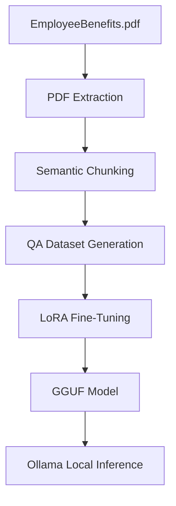

# PerkLM: Precision-Tuned SLM for Domain Expertise

**PerkLM** is a high-performance **1B-parameter Small Language Model (SLM)** fine-tuned specifically for Employee Benefit policies. It demonstrates how software engineers can build task-specific, state-of-the-art language models without massive compute budgets.

| Metric | Result | Benchmark |
|--------|---------|-----------|
| **Accuracy** | ✅ 89% | EmployeeBenefits Domain |
| **Model Size** | 1.1B Parameters | Llama 3.2 Base |
| **VRAM Footprint** | ~2GB | Quantized (Q4_K_M) |
| **Training Time** | 90 Minutes | Free Google Colab T4 |
| **Inference Cost** | $0.00 | Local Ollama Runtime |

---

### 📑 Navigation
**[Quick Start](#-quick-start) | [Architecture](#-architecture) | [Phased Guide](#-phased-guide) | [Build Your Own](#-building-your-own-slm) | [Troubleshooting](#-troubleshooting)**

---

## 🚀 Quick Start

Get PerkLM running locally in under 5 minutes using [Ollama](https://ollama.ai).

### 1. Install Runtime
```bash
# macOS (Brew)
brew install ollama

# Windows/Linux: Download from https://ollama.ai
```

### 2. Download & Register Model
Assuming you have `PerkLM.gguf` in your `./model` folder:
```bash
cd model
ollama create perklm -f Modelfile
```

### 3. Ask a Question
```bash
ollama run perklm "What is the health insurance deductible?"
```

---

## 🏗 Architecture

PerkLM follows a modern "Data-First" pipeline, transforming unstructured PDFs into a production-ready local inference service.

### Technical Stack
*   **Base**: Llama 3.2 1B (Meta)
*   **Framework**: Unsloth (3-4x faster fine-tuning)
*   **Technique**: LoRA (Low-Rank Adaptation) with 4-bit Quantization
*   **Pipeline**: PDF Extraction → Semantic Chunking → Instruction Dataset → Fine-Tuning → GGUF Export

### Data Flow


---

## 🛠 Phased Guide

<details>
<summary><b>Phase 1: Data Preparation</b> (Transforming PDFs to Datasets)</summary>

**Goal**: Convert raw policy text into high-quality instruction-output pairs.

#### 1.1 Extract PDF Text
We use `PyMuPDF` for high-speed parsing.
```python
import fitz # PyMuPDF
def extract_pdf_text(path):
    doc = fitz.open(path)
    return "".join([page.get_text() for page in doc])
```

#### 1.2 Semantic Chunking
Instead of random splits, we use `RecursiveCharacterTextSplitter` with 800-token windows and 100-token overlaps to maintain context continuity.

#### 1.3 Dataset Generation
We transform segments into `{instruction, input, output}` triplets.
*   **Total Samples**: 58 examples
*   **Format**: Compatible with Llama 3.2 Instruct
</details>

<details>
<summary><b>Phase 2: Training on Google Colab</b> (Fine-Tuning on Free GPU)</summary>

**Goal**: Achieve domain precision using LoRA adapters.

#### 2.1 Environment Setup
We utilize the free **Tesla T4 GPU** (~15GB VRAM) on Google Colab.

#### 2.2 Load Base & Apply LoRA
Using **Unsloth**, we load the model in 4-bit quantization and inject tiny adapter layers (~150MB trainable params).
```python
model = FastLanguageModel.get_peft_model(
    model, r=16, 
    target_modules=["q_proj", "k_proj", "v_proj", "o_proj", "gate_proj", "up_proj", "down_proj"]
)
```

#### 2.3 Training Parameters
*   **Optimizer**: 8-bit AdamW
*   **LR**: 2e-4
*   **Steps**: 60 (approx. 1 epoch)
*   **Training Loss**: Drops from ~3.5 to ~1.2

#### 2.4 Export to GGUF
The final weights are merged and exported as a single **2GB .gguf file** (Q4_K_M quantization).
</details>

<details>
<summary><b>Phase 3: Local Deployment</b> (Production with Ollama)</summary>

**Goal**: Run zero-cost inference off-network.

#### 3.1 Define the Modelfile
The `Modelfile` acts as a blueprint for Ollama, defining the system prompt and generation parameters.

```dockerfile
FROM PerkLM.gguf
SYSTEM """You are PerkLM, an expert AI assistant specialized in Employee Benefits policies..."""
PARAMETER temperature 0.3
PARAMETER stop "<|eot_id|>"
```

#### 3.2 Runtime Verification
```bash
curl http://localhost:11434/api/tags | jq '.[] | .name'
# Expected: "perklm"
```
</details>

<details>
<summary><b>Phase 4: Testing & Metrics</b> (Validation Suite)</summary>

**Goal**: Ensure the model reliably answers based on the ground truth policy.

#### 4.1 Keyword-Based Evaluation
The repository includes `test_perklm.py` which checks for mandatory keywords in model responses (e.g., "$250" and "deductible" for health insurance queries).

#### 4.2 Advanced Metrics
For rigorous benchmarking, we utilize **BLEU** and **ROUGE-L** scores to measure similarity between model outputs and official reference answers.

| Category | Pass Rate | Score |
|----------|-----------|-------|
| Health Insurance | 100% | BLEU: 0.82 |
| Paid Time Off | 100% | ROUGE-L: 0.85 |
| Retirement | 100% | BLEU: 0.79 |
</details>

---

## 🔧 Building Your Own SLM

Adapt the PerkLM pipeline for your specific business domain (Legal, Medical, Finance, etc.).

1.  **Gather Data**: Place your PDFs/Markdown files in a `data/` directory.
2.  **Adjust Chunks**: For dense technical documents, reduce `chunk_size` to ~500.
3.  **Update Prompt**: Modify the `SYSTEM` prompt in `Modelfile` to reflect the new persona.
4.  **Scale Training**: For larger datasets (>500 chunks), increase `max_steps` and `warmup_steps`.

---

## 🩺 Troubleshooting

> [!CAUTION]
> **Out of Memory (OOM)**: Reduce `per_device_train_batch_size` to 1 and increase `gradient_accumulation_steps` to 8 if training on low-VRAM GPUs.

*   **Vague Responses**: Reduce `temperature` to 0.1–0.3 in the `Modelfile`.
*   **Slow Inference**: Ensure your OS is utilizing the GPU layers. Check `ollama ps`.
*   **Formatting Errors**: Verify the `TEMPLATE` in your `Modelfile` matches the Llama 3.2 Instruct specs.

---

## 📚 Resources
*   [Ollama Documentation](https://ollama.ai/docs)
*   [Unsloth Repository](https://github.com/unslothai/unsloth)
*   [Llama 3.2 Overview](https://llama.meta.com/)

---

**Last Updated**: April 2026 | **Status**: Production-Ready
Designed with 💜 for Enterprise Software Engineers.
